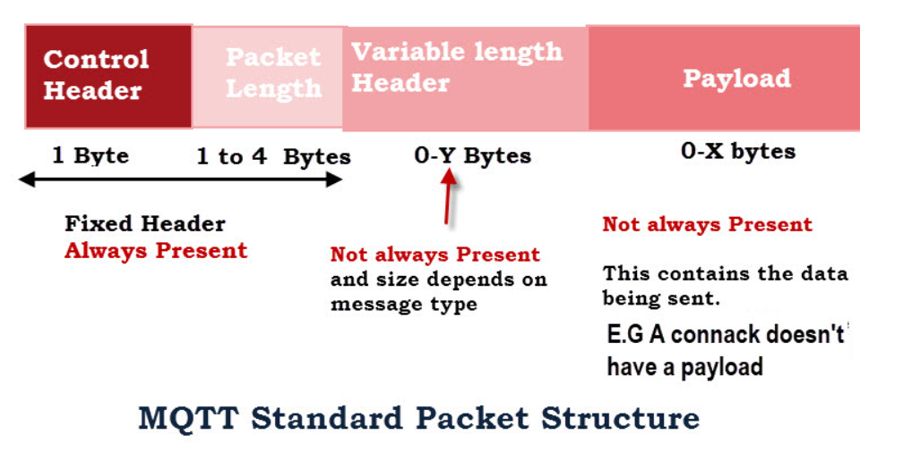
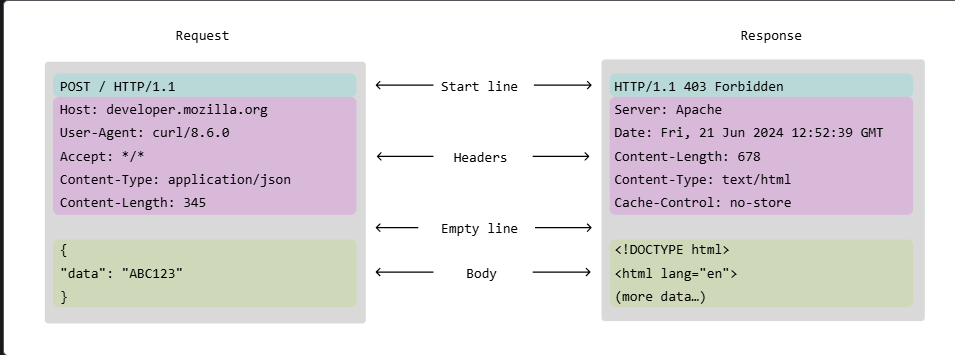

# Open ended Question
## 1. Compare MQTT and HTTP for IoT data transmission. Which would you choose for batterypowered GPS trackers? Why?
  I would choose the MQTT. The device is the low resource device, so we need the lightweight communication model.
  We need to minimize the power consumption and bandwidth for the communication.
  Reasons
  1. Communication model
  - For the periodic data, Pub/sub(MQTT) model is better that the req/resp(HTPP). 
  - For req/resp, we need an overhead time to initiate the communication and wait for resp. 
  - For pub/sub, publisher and subscriber can work independently. No blocking.
  - Easy to do one to many. 1 publisher can have many subscribers. 1 subscriber can have many data from publishers.
  2. Network Efficiency
  - MQTT have smaller overhead. The header of message require only 2 bytes.
   ref. http://www.steves-internet-guide.com/mqtt-protocol-messages-overview/
  - HTTP require a lot of header
   ref. https://developer.mozilla.org/en-US/docs/Web/HTTP/Guides/Messages
  - Lower data, so we can have a minimal bandwidth
  3. Power Consumption
  - MQTT is minimal. They have lower operations needed for the communication, so the lower power consumption than HTTP.
  4. Community
  - They have a lot of approch using MQTT for the IoT device.
## 2. How would you reconnect an ESP32 automatically when Wi-Fi connection drops?
  Basically, If we are using MQTT and Arduino, the library should handle the reconnection automatically.
  But, if it is not working, we should have the non-blocking process for the reconnection.
  In the disconnected state, we may have the crucial information that we don't want to lost it.
  Hence we should save this information in the limited memory and we can upload this data when the connection is back.
  In the same time, the program should retry the conection.

  From the https://github.com/espressif/arduino-esp32/blob/fc8ce8f80800bc271019c67d00ba566ce2bb309f/libraries/WiFi/src/STA.cpp#L58, the WIFI library will reconnect if the status falls to reconnectable reasons. We can set the wifi event to check for that. If it is not a reconnectable reasons, we can set the flag to reconnection in the main loop.
  To retry the connection, we should find the suitable period. Not too much, we lost the power. Not to slow, we don't want to disconnect for a long time.
  After WIFI is reconnect, we should reconnect the communication(MQTT) as well.
  
## 3. Describe how you would implement over-the-air (OTA) firmware updates securely for ESP32 IoT devices.
The crucial things that we need to concern in this topic are 2 things.
1. Error handling
We need a mechanism that the firmware is not lost if the updating is interrupted by something.
For the worst case scenario, we should roll back to the previous one.
To achive this, the flash memory should have the partition table that keep the working firmware and the new firmware. The new firmware should update into the second partition, when it is proved to work. We can write it to the primary partition. If it is not working, we can use the primary partition.
2. The timing to update
I would say we should have the specific timing to update and we should have the authenticate from the user.
I think we must have the application in the mobile that can connect to the device for configuration.
So, we could get the authentication for the update when the user connect the bluetooth to the device.
For the OTA mechanism, we could get the firmware either from the bluetooth, WIFI or the internet.
For the reliable way, I think we could get from the WIFI or bluetooth.
## 4. How would you reduce ESP32 power consumption during idle periods?
ESP32 can do the deep sleep. For example, we can turn of the WIFI, Bluetooth, cut off the power to the external device. This operation could take sometime. Either for terminate and initialize again.
Thus, we need to concern about the period. If we have long enough period, we can shutdown everything, reinitialize again for working. But, if we want more frequency data, we should decide what to do.
Two main things to do, disable the device from software, cut the power of the device from hardware level.

## 5. How would you filter GPS noise or jitter in position readings?
We have the IMU in the system, so I would say Kalmain filter is the useful method.
The IMU data can recollect the GPS data when it is jumping.
GPS data usually slow, if we need the high frequency. The fusion method with IMU also help.
We can do the prediction from IMU data and we can do the correction from the GPS data.
The kalmain filter is strong for the outlier. It depends on the history data.
If there is a jump, they can filter out.
Anyway, we can adjust the gain, how would they react to the outlier.